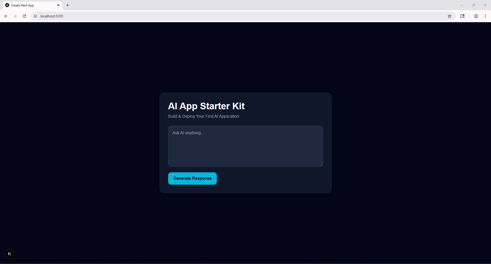
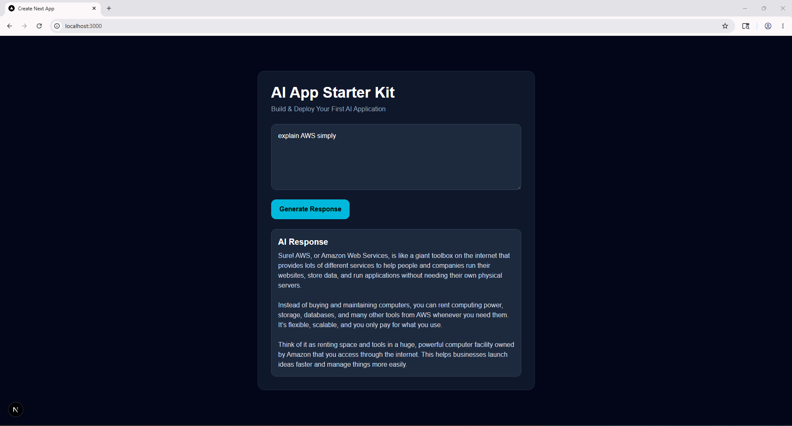
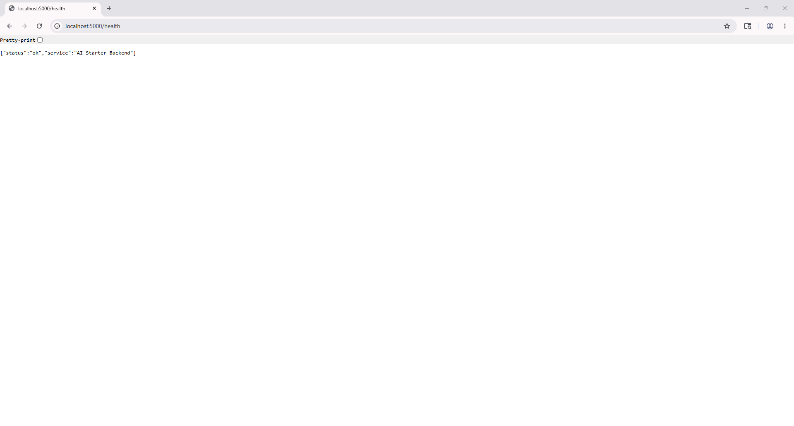
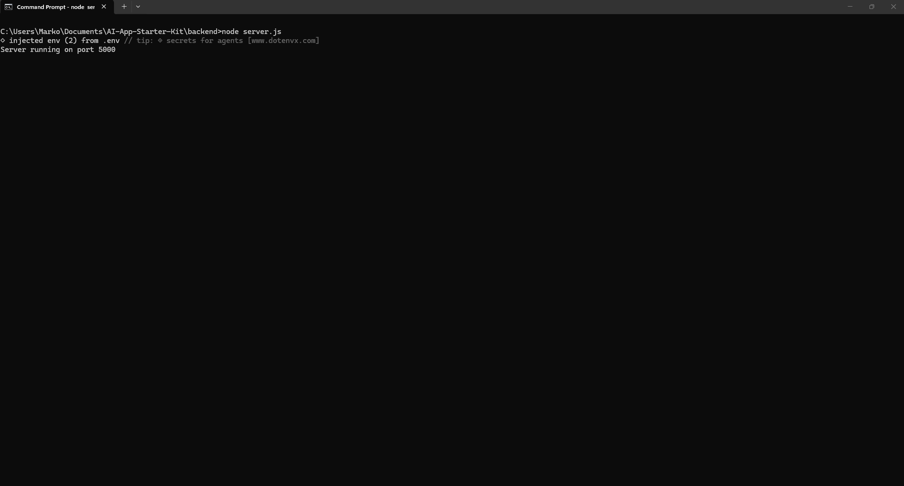
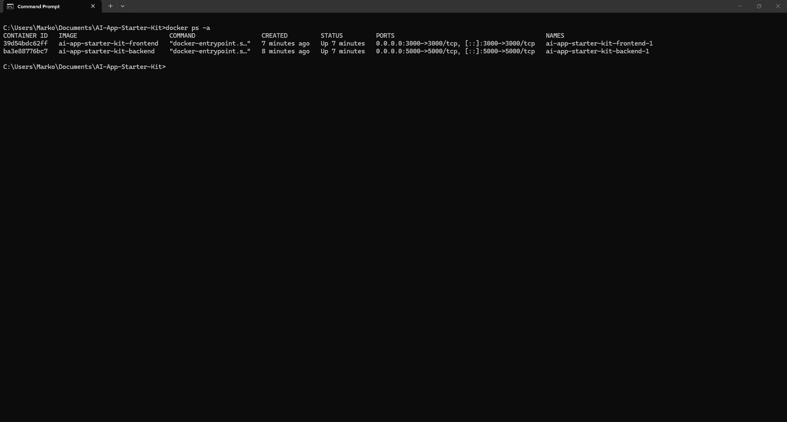
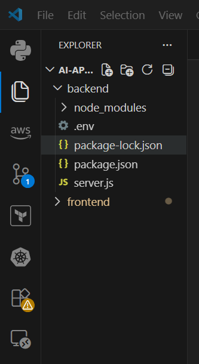

# AI App Starter Kit

Build & Deploy Your First AI Application

A beginner-friendly AI engineering starter project using:

- Next.js
- Node.js
- OpenAI API
- Docker

---

# Overview

AI App Starter Kit is a simple full-stack AI application designed to help beginners learn how modern AI systems are built and deployed.

This project demonstrates:

- frontend ↔ backend communication
- OpenAI API integration
- Docker containerization
- production-style API architecture
- health check endpoints
- deployment workflows

The goal of this project is to help developers build and deploy their first real AI application.

---

# Features

- Modern Next.js frontend
- Express.js backend API
- OpenAI API integration
- AI response generation
- Docker containerization
- Docker Compose orchestration
- Health endpoint
- Beginner-friendly architecture
- Production-style project structure

---

# Tech Stack

## Frontend
- Next.js
- TypeScript
- Tailwind CSS

## Backend
- Node.js
- Express.js

## AI
- OpenAI API

## DevOps
- Docker
- Docker Compose

---

# Project Structure

```bash
AI-App-Starter-Kit/
│
├── backend/
│
├── frontend/
│
├── screenshots/
│
├── docker-compose.yml
│
├── .gitignore
│
└── README.md
```

---

# Screenshots

## AI Application UI



---

## AI Response Generated



---

## Backend Health Endpoint



---

## Backend Server Running



---

## Docker Containers Running



---

## Project Structure



---

# Installation

## Clone Repository

```bash
git clone https://github.com/YOUR-USERNAME/AI-App-Starter-Kit.git
```

---

# Backend Setup

```bash
cd backend
npm install
```

Create a `.env` file:

```env
OPENAI_API_KEY=your_openai_api_key
PORT=5000
```

Start backend:

```bash
node server.js
```

---

# Frontend Setup

```bash
cd frontend
npm install
npm run dev
```

Open:

```text
http://localhost:3000
```

---

# Docker Setup

From the project root:

```bash
docker compose up --build
```

Open:

```text
http://localhost:3000
```

---

# API Endpoint

## POST /api/chat

Example request:

```json
{
  "prompt": "Explain Docker simply"
}
```

Example response:

```json
{
  "response": "Docker is a platform..."
}
```

---

# Health Check

Open in browser:

```text
http://localhost:5000/health
```

Expected response:

```json
{
  "status": "ok",
  "service": "AI Starter Backend"
}
```

---

# Environment Variables

## backend/.env

```env
OPENAI_API_KEY=your_openai_api_key
PORT=5000
```

---

# Docker Architecture

```text
Frontend Container
        ↓
Backend Container
        ↓
OpenAI API
```

---

# Learning Goals

This project helps beginners understand:

- AI application architecture
- OpenAI API integration
- frontend ↔ backend communication
- Docker containerization
- deployment fundamentals
- production-style application structure

---

# Future Improvements

Future versions may include:

- authentication
- vector databases
- RAG systems
- AI agents
- CI/CD pipelines
- cloud deployment
- monitoring systems

---

# Author

Built by Demarko Little

---

# License

MIT License
>>>>>>> 2c35437 (updated README file)
