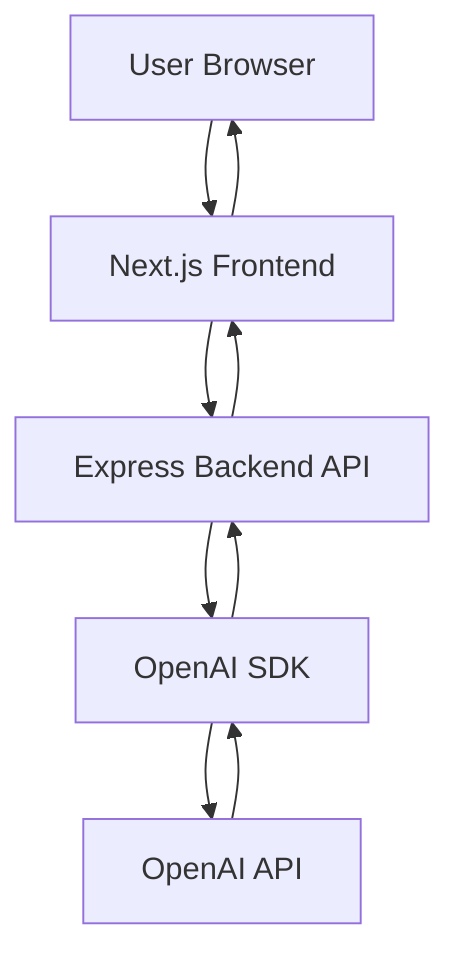
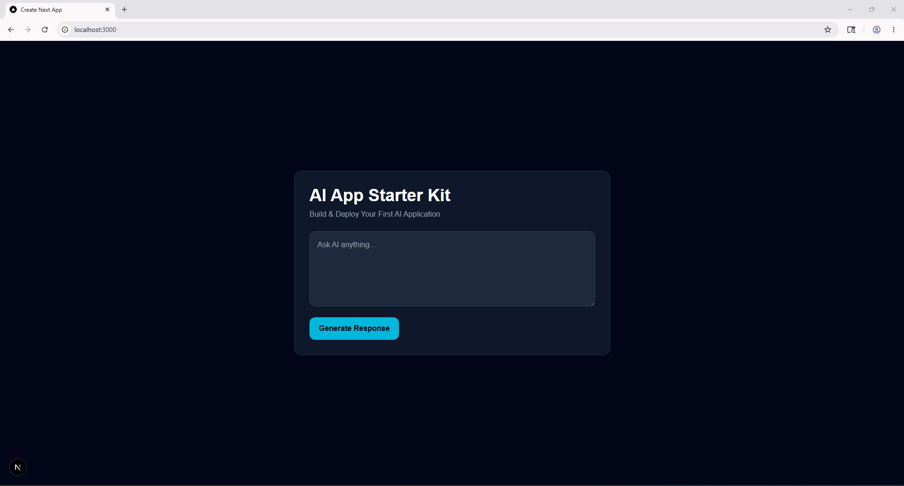
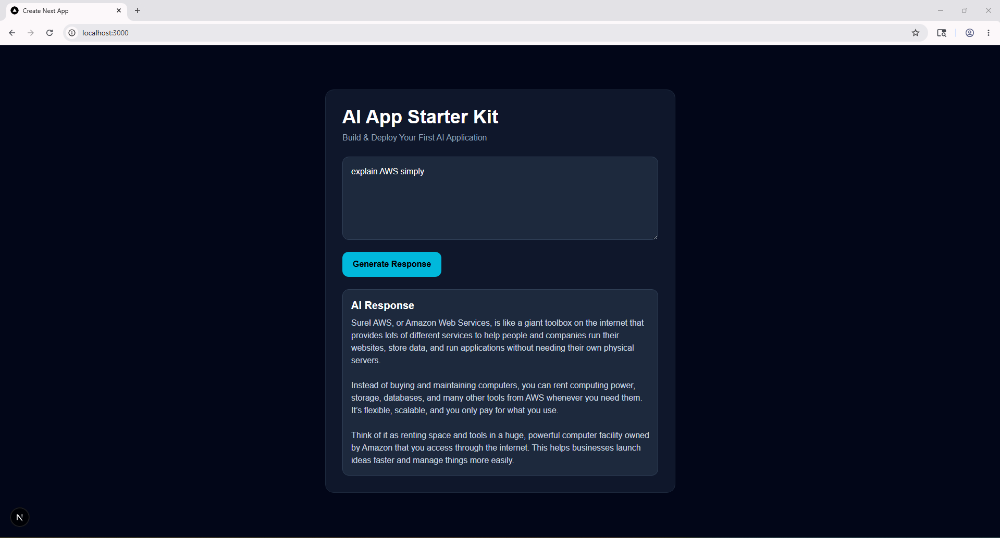
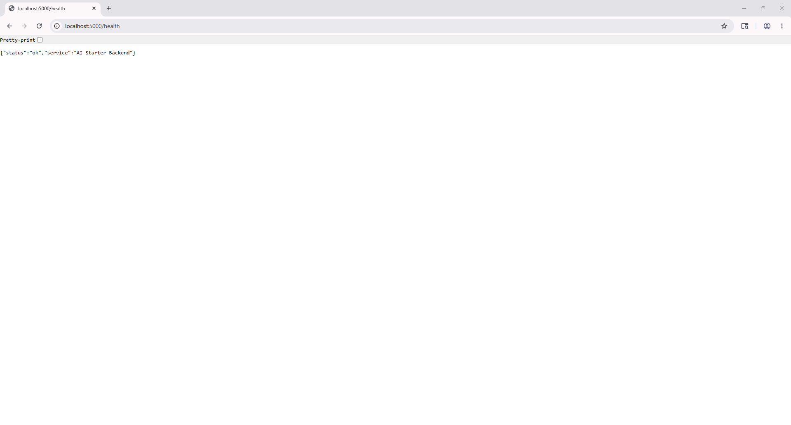
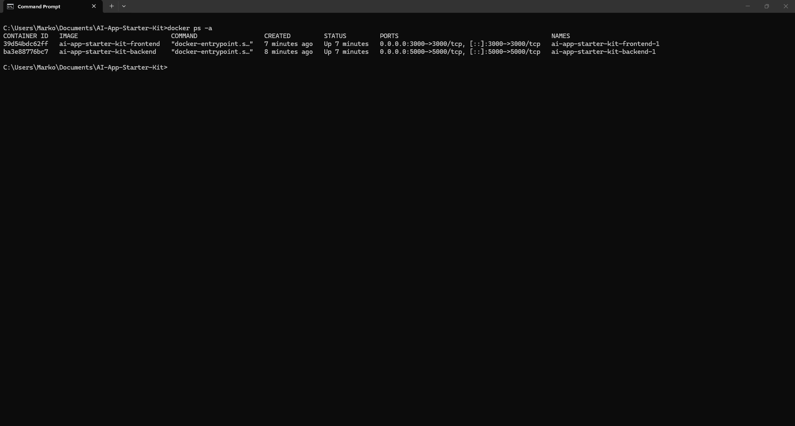

# 🚀 AI App Starter Kit -- Community Edition v1.0

> **Build Your First Production-Ready AI Application**\
> A free, open-source starter project demonstrating how a modern AI
> application is designed, built, containerized, and deployed using
> industry-standard technologies.


------------------------------------------------------------------------

# Welcome

AI App Starter Kit -- Community Edition is the official open-source
starter project from **DemarkoCloud** for developers who want to learn
how production-ready AI applications are built.

Unlike basic tutorials, this project demonstrates how a modern frontend,
backend API, AI service, and Docker-based development environment work
together in a clean, production-style architecture. The goal is to help
students, aspiring AI engineers, cloud engineers, and software
developers gain practical experience with technologies used in real
engineering teams.

This repository serves as the **Community Edition** of the AI App
Starter Kit. The companion **Professional Edition** expands on this
foundation with premium documentation, guided walkthroughs, and future
updates.

------------------------------------------------------------------------

# Table of Contents

-   Community Edition
-   Project Objectives
-   Features
-   Technology Stack
-   Quick Start
-   Architecture Overview
-   Repository Structure
-   Screenshots
-   Prerequisites
-   Installation
-   Environment Variables
-   Running Locally
-   Docker Deployment
-   API Reference
-   Troubleshooting
-   Frequently Asked Questions
-   Learning Outcomes
-   Roadmap
-   Professional Edition
-   About DemarkoCloud
-   Contributing
-   License

------------------------------------------------------------------------

# Community Edition

The Community Edition is completely free and open source.

Included:

-   Complete source code
-   Next.js frontend
-   Express backend
-   OpenAI API integration
-   Docker support
-   Production-style project structure
-   Community-driven improvements

------------------------------------------------------------------------

# Project Objectives

-   Learn production AI application architecture
-   Understand frontend ↔ backend communication
-   Integrate the OpenAI API securely
-   Containerize applications using Docker
-   Build an interview-ready portfolio project
-   Practice professional engineering workflows

------------------------------------------------------------------------

# Features

## Frontend

-   Next.js
-   TypeScript
-   Tailwind CSS
-   Responsive UI

## Backend

-   Express.js
-   REST API
-   Health endpoint
-   Environment variables
-   Error handling

## AI

-   OpenAI API integration
-   AI response generation

## DevOps

-   Docker
-   Docker Compose
-   Multi-container workflow

------------------------------------------------------------------------

# Technology Stack

  Layer           Technology
  --------------- -------------------
  Frontend        Next.js
  Backend         Node.js + Express
  Language        TypeScript
  Styling         Tailwind CSS
  AI              OpenAI API
  Containers      Docker
  Orchestration   Docker Compose

------------------------------------------------------------------------

# Quick Start (60 Seconds)

``` bash
git clone https://github.com/dlittle-source/AI-App-Starter-Kit.git
cd AI-App-Starter-Kit
```

Install dependencies.

``` bash
cd backend
npm install

cd ../frontend
npm install
```

Create **backend/.env**

``` env
OPENAI_API_KEY=your_api_key_here
PORT=5000
```

Run the backend.

``` bash
cd backend
npm run dev
```

Run the frontend.

``` bash
cd frontend
npm run dev
```

Open:

    http://localhost:3000

------------------------------------------------------------------------

# Architecture Overview


``` mermaid
flowchart TD
A[User Browser] --> B[Next.js Frontend]
B --> C[Express Backend API]
C --> D[OpenAI SDK]
D --> E[OpenAI API]
E --> D
D --> C
C --> B
B --> A
```

The frontend communicates with a dedicated backend service responsible
for securely handling OpenAI requests. This mirrors the separation of
concerns used in production applications.

------------------------------------------------------------------------

# Repository Structure

``` text
AI-App-Starter-Kit/
├── backend/
├── frontend/
├── screenshots/
├── docker-compose.yml
├── README.md
└── .gitignore
```

------------------------------------------------------------------------

# Screenshots

## Home Page



## AI Response



## Health Endpoint



## Docker Containers



------------------------------------------------------------------------

# Prerequisites

-   Node.js 20+
-   npm
-   Docker Desktop
-   Git
-   OpenAI API Key

------------------------------------------------------------------------

# Installation

``` bash
git clone https://github.com/dlittle-source/AI-App-Starter-Kit.git
cd AI-App-Starter-Kit
```

Install backend and frontend dependencies.

------------------------------------------------------------------------

# Environment Variables

``` env
OPENAI_API_KEY=your_api_key_here
PORT=5000
```

Never commit secrets to source control.

------------------------------------------------------------------------

# Running Locally

Backend:

``` bash
npm run dev
```

Frontend:

``` bash
npm run dev
```

------------------------------------------------------------------------

# Docker Deployment

``` bash
docker compose up --build
```

Stop:

``` bash
docker compose down
```

------------------------------------------------------------------------

# API Reference

## POST /api/chat

``` json
{
  "message": "Explain cloud computing."
}
```

Example response:

``` json
{
  "response": "Cloud computing is..."
}
```

## GET /health

``` json
{
  "status": "Healthy"
}
```

------------------------------------------------------------------------

# Troubleshooting

### Missing API Key

Ensure `backend/.env` exists and contains a valid `OPENAI_API_KEY`.

### Docker Issues

``` bash
docker compose down
docker compose up --build
```

### Node Version

``` bash
node -v
```

Use Node.js 20 or later.

------------------------------------------------------------------------

# Frequently Asked Questions

### Is this beginner friendly?

Yes. The project is designed for developers learning modern AI
engineering.

### Do I need Docker?

No, but it is recommended.

### Can I replace OpenAI?

Yes. The architecture supports swapping AI providers.

### Is this portfolio worthy?

Absolutely. The project follows production-inspired engineering
practices.

------------------------------------------------------------------------

# Learning Outcomes

By completing this project you will learn to:

-   Build AI-powered web applications
-   Integrate external AI APIs
-   Separate frontend and backend services
-   Use Docker for local development
-   Understand production application architecture

------------------------------------------------------------------------

# Roadmap

Future releases include:

-   Authentication
-   Chat history
-   Streaming responses
-   Unit tests
-   GitHub Actions
-   AWS deployment guide
-   Monitoring and logging

------------------------------------------------------------------------

# Professional Edition

The Professional Edition expands upon this repository with:

-   Guided implementation
-   Architecture deep dives
-   Premium documentation
-   Future updates
-   Enhanced learning resources

Available on Gumroad.

------------------------------------------------------------------------

# About DemarkoCloud

DemarkoCloud builds production-style engineering projects focused on:

-   Cloud Engineering
-   Platform Engineering
-   DevOps
-   AI Engineering
-   Terraform
-   Docker
-   Linux
-   AWS

Our mission is to help developers learn by building real-world projects
with professional documentation.

------------------------------------------------------------------------

# Contributing

Contributions are welcome.

1.  Fork the repository.
2.  Create a feature branch.
3.  Commit your changes.
4.  Open a Pull Request.

------------------------------------------------------------------------

# License

This project is licensed under the MIT License.

------------------------------------------------------------------------

# Connect

If you found this project helpful:

-   ⭐ Star the repository
-   🍴 Fork the project
-   💬 Share feedback
-   🚀 Explore additional DemarkoCloud projects

Happy Building!
